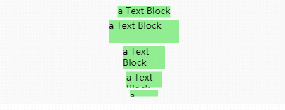

## 介绍
gojs采用的是：
+ 面向对象编程模式
+ 以图形对象表示**绘图模板**, 普通js对象存储数据作为**数据模型**，然后赋值给图形对象的属性作为数据绑定的模式
## 文档地址
+ 半中文官网：[https://gojs.net.cn/index.html](https://gojs.net.cn/index.html)
+ 官网：[https://gojs.net/latest/index.html](https://gojs.net/latest/index.html)
+ CSDN:[https://blog.csdn.net/qq_29287561/article/details/81166921](https://blog.csdn.net/qq_29287561/article/details/81166921)
## 快速上手
GoJS依赖于HTML5特性的JavaScript库，所以你需要确保你的页面声明它是一个HTML5文档。当然，你需要加载库:
```html
<!-- 指定文档类型为 HTML5  -->
<!DOCTYPE html>  
    <html>
    <head>
    <!-- 开发时请使用 go-debug.js，最终部署用 go.js -->
<script src="go.js"></script>
```
每个goJS图形实例都是需要一个HTML容器，并且指明大小
```html
<div id="box" style="width: 100%;height: 700px"></div>
```
```javascript
//利用GraphObject.make 超类实例出一个Object
const $ = go.GraphObject.make;
// 挂在到全局下
window.diagram = $(go.Diagram,'box',
    {
        //Diagram配置项...
    }
)
```
## 节点
**goJs中可以把所有的图形对象称为节点**
+ [Ground(组)](https://gojs.net.cn/intro/groups.html)
+ [Node(节点)](https://gojs.net.cn/intro/buildingObjects.html)
## 图形类
goJs的图形类很多，不过都是围绕着**7个超类**来使用的，很多其他类都是属于这7个超类的子类
### Diagram
Diagram是于HTML的 div相关联 ，它创建的是一个Canvas元素,
理论上来讲它配置项都基于go.Diagram下初始化配置的
它最终会实例化出来一个**顶层对象**
### PanelLayout
这是所有面板布局的抽象基类 ,如果需要自己自定义面板布局，可以创建PanelLayout的子类来创建模型

默认情况下，它有12个子类
```javascript
'Position': PanelLayoutPosition, //绝对定位
'Horizontal': PanelLayoutHorizontal, //横向
'Vertical': PanelLayoutVertical,   //垂直
'Spot': PanelLayoutSpot,   //相对定位
'Auto': PanelLayoutAuto,   //自适应
'Table': PanelLayoutTable,	//表格布局
'Viewbox': PanelLayoutViewbox,
'TableRow': PanelLayoutTableRow,
'TableColumn': PanelLayoutTableColumn,
'Link': PanelLayoutLink, //定义link
'Grid': PanelLayoutGrid,  //网格布局
'Graduated': PanelLayoutGraduated,
```
可以通过调用静态函数`Panel.definePanelLayout`来创建自定义面板布局
```javascript
//definePanelLayout('名字‘,钩子函数)
Panel.definePanelLayout('Table', new PanelLayoutTable());
```
### GraphObject
这是所有图形对象的**抽象基类**，
>继承它的包括：Shape,TextBlock,Picture以及 **Panel**(这个有点特殊)
### Shape
画几何图形的对象， [Geometry](https://gojs.net.cn/api/symbols/Geometry.html)决定了画什么，属性 `fill`（填充颜色） 和 `stroke`（边框）以及其他属性决定了如何绘制。

当然，goJs默认有提供静态字符调用如：
```javascript
  diagram.add($(go.Part,
      $(go.Shape, "Circle", {
        fill: $(go.Brush, { color: "palegreen" })
      })
    ));
```
使用**Circle**关键字可以直接画出一个圆形出来
<div style="text-align: center">

</div>

这得益于goJs本身支持
goJs默认有的[效果](https://gojs.net.cn/samples/shapes.html)
### TextBlock
文本的大小和风格外观由`TextBlock.font`指定

通过设置 font  属性可以设置字体类型 ，跟CSS一样顺序
> ont-style font-variant font-weight font-size font-family
```javascript
diagram.add(
    $(go.Part, "Vertical",
        $(go.TextBlock, { text: "a Text Block" }),
        $(go.TextBlock, { text: "a Text Block", stroke: "red" }),
        $(go.TextBlock, { text: "a Text Block", background: "lightblue" }),
        $(go.TextBlock, { text: "a Text Block", font: "bold 14pt serif" })
    ));
```
<div style="text-align: center">

</div>

**文本块的自然大小刚好大到可以用给定的字体呈现文本字符串。然而，文本块的实际大小可以在任何一个维度上变大或变小。较大的尺寸导致区域没有文字;更小的尺寸导致剪切**
```javascript
diagram.add(
    $(go.Part, "Vertical",
      $(go.TextBlock, { text: "a Text Block", background: "lightgreen", margin: 2 }),
      $(go.TextBlock, { text: "a Text Block", background: "lightgreen", margin: 2,
                        width: 100, height: 33 }),
      $(go.TextBlock, { text: "a Text Block", background: "lightgreen", margin: 2,
                        width: 60, height: 33 }),
      $(go.TextBlock, { text: "a Text Block", background: "lightgreen", margin: 2,
                        width: 50, height: 22 }),
      $(go.TextBlock, { text: "a Text Block", background: "lightgreen", margin: 2,
                        width: 40, height: 9 })
    ));
```
<div style="text-align: center">

</div>

通过 `overflow` 属性可以设置文字溢出处理     
```javascript
    go.TextBlock.OverflowClip //默认值
    go.TextBlock.OverflowEllipsis //(后面3个小点点)
```
通过 `text` 来控制显示的文字  可以通过 new go.Binding来绑定数据模型对象，达到**数据驱动视图**

通过 ` TextBlock.editable`来控制文本是否可编辑,默认`true`
### Picture
显示图像、视频帧或画布元素的图形对象
可以通过将 source  URL属性设置为URL字符串或将元素属性设置为`HTMLImageElement`、`HTMLCanvasElement`或`HTMLVideoElement`来指定要显示的内容。

如果URL只是一个简单的常量字符串，则可以将该字符串直接作为参数传递给对象，而不用分配`source`属性。这两种方法都有相同的效果。
```javascript
diagram.add(
   $(go.Part,
     $(go.Picture, "../.vuepress/public/20200617174124.png"),
     $(go.Picture, 
        { source: "/images/intro/100x65.png", column: 0,margin: 2 }),
   ));
 //两者都是相同效果
```
### Panel
它是`GraphObject`类，但是它可以把`其他GraphObject`作为它的元素，它可以`控制其他GraphObject类`的大小和位置
默认10种类型
```javascript
Panel.Position   //默认类型 根据 GraphObject.position来排列
Panel.Vertical   //垂直放置
Panel.Horizontal  //水平放置
Panel.Auto 
Panel.Spot  //相对定位
Panel.Table 
Panel.Viewbox
Panel.Link 
Panel.Grid 
Panel.Graduated 
```
它有个`Part`，而Part是`Node和Link的基类` 
## 公有属性
所有节点块定义都能通用的属性
```javascript
minSize     最小范围  NaN为自适应	new go.Size(50,NaN) 或者new go.Size(50,200)
maxSize     最大范围  NaN为自适应
width	    宽
height      高
margin		外边距
alignment	元素位置
defaultAlignment 子元素位置
visible		是否可见
```
## 网格(grid)
网格是使用一种面板来实现的，即`Panel.grid`。与大多数其他类型的面板一样，网格面板可以在节点或任何其他类型的部件中使用。但是当它们被用作`Diagram.grid`，它们的范围实际上是无限的。

默认情况下去，goJS有个默认网格，你可以通过`visible`来控制是否显示
```javascript
diagram.grid.visible = true;

  diagram.nodeTemplate =
    $(go.Node, "Auto",
      $(go.Shape, "Rectangle", { fill: "lightgray" }),
      $(go.TextBlock, { margin: 5},
        new go.Binding("text", "key"))
    );
  var nodeDataArray = [
    { key: "Alpha" }, { key: "Beta" }, { key: "Gamma" }
  ];
  diagram.model = new go.GraphLinksModel(nodeDataArray);
```
<div style="text-align: center">

</div>

 [DraggingTool(拖拽工具)](https://gojs.net.cn/api/symbols/DraggingTool.html)和[ResizingTool(调整大小)](https://gojs.net.cn/api/symbols/ResizingTool.html)工具可以根据背景网格模式改变它们的行为
 前提需你设置了`DraggingTool.isGridSnapEnabled`和/或`ResizingTool.sGridSnapEnabled`属性为真。

可以通过`Panel.gridCellSize` 来改变网格的单元格大小
```javascript
diagram.grid.gridCellSize = new go.Size(30, 20);
```
当然也可以使用`Panel`来自定义网格
```javascript
grid: $(go.Panel, 'Grid',
                {gridCellSize: new go.Size(60, 60), visible: true},
                $(go.Shape, 'LineH', {stroke: '#ccc', strokeWidth: 1}),
                $(go.Shape, 'LineH', {
                    stroke: '#ccc',
                    strokeWidth: 1,
                    interval: 5
                }),
                $(go.Shape, 'LineV', {stroke: '#ccc', strokeWidth: 1}),
                $(go.Shape, 'LineV', {
                    stroke: '#ccc',
                    strokeWidth: 1,
                    interval: 5
                })
            )
```
[**常用API>>>**](#节点)
## 事件
goJs的事件分为三类：
- [图表事件（ DiagramEvent ）](#图表事件)
- 操作类( inputEvents )
- 模型类( ChangedEvent )
### 图表事件
图表事件比操作类事件更加**抽象**的事件
- `BackgroundSingleClicked`  背景单击事件
- `BackgroundDoubleClicked` 背景双击事件
- `BackgroundContextClicked`  背景右键事件
- `ChangingSelection` 改变选择前事件
- `ChangedSelection` 改变选择后事件
- `ClipboardChanged` 剪切板改变事件
- `ClipboardPasted` 剪切板粘贴事件
- `DocumentBoundsChanged` 文档范围改变事件
- `ExternalObjectsDropped` (节点或线等)零部件拖放生成事件
- `InitialLayoutCompleted` 初始化布局完成事件
- `LayoutCompleted` 布局完成事件
- `LinkDrawn` 线创建事件

**当使用`LinkDrawn`事件的时候，事件回调返回`DiagramEvent.subject`为新创建的线对象**
```javascript
diagram.addDiagramListener('LinkDrawn', (e) => {
 e.subject
})
```
- `LinkRelinked` 线重新连接事件

**`DiagramEvent.subject` 为修改的线,`DiagramEvent.paramete` 为线被断开的 GraphObject端口**
- `ObjectDoubleClicked` 双击了图形对象（节点和线等）
- `ObjectContextClicked` 右键单击了图形对象,节点和线等
- `ObjectSingleClicked`  单击了图形对象节点和线等
- `ObjectDoubleClicked` 双击了图形对象（节点和线等）
- `ObjectContextClicked` 右键单击了图形对象,节点和线等
- `ObjectSingleClicked`  单击了图形对象节点和线等
- `PartResized` Part大小改变事件
- `PartRotated` Part旋转事件
- `SelectionMoved` Part拖动事件
- `SelectionCopied` Part复制事件
- `SelectionDeleted` 删除后事件
- `SelectionDeleting` 删除前事件
- `SelectionGrouped` 选择创建分组事件
- `SelectionUngrouped` 用户已删除选定的组事件
- `SubGraphCollapsed` 子图折叠事件'
- `SubGraphExpanded` 子图展开事件
- `TreeCollapsed` 树折叠事件'
- `TreeExpanded` 树展开事件'
- `TextEdited` 文本修改事件
- `ViewportBoundsChanged` 视窗范围改变事件

`DiagramEvent.subject` ,为目标对象,`scale`是属性是旧的 `Diagram.scale` 值,`position`属性是旧的`Diagram.position` 值,`bounds` 属性是旧的 `Diagram.viewportBounds` 值,`DiagramEvent.parameter` 是旧的`viewportBounds Rect`.

```javascript
Diagram.addDiagramListener('事件名','回调函数')
subject //是目标对象 即Part类的集合
```

[**常用API>>>**](#节点)
